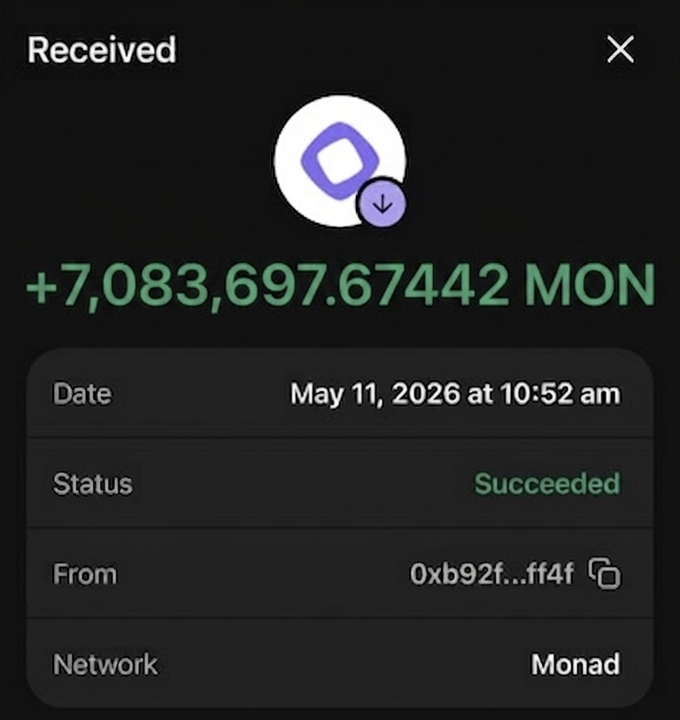

  

<h1 align="center">What's cRACKIN?</h1>
👀👥

## About me:
* 🔭 I’m currently working on elavating.
* 💬 Ask me about anything!
* ⚡ I'm AI-Assisted Developer (Centaur)
* 📍 I'm from Chicago.... Livin in Cali
* ♒️ I'm an Aquarius

### 💻 Languages
         

### ⚙️ DevOps, Infrastructure & Build Tools
     

### ☁️ Cloud Providers
     

### 🔒 Security, AI & Low-Level Perf
      

### 📱 Platform Support
   

### 🎮 Game Dev & Styling
  

### 👾 Community & Servers
         

#### Crates.io Profile

## Donation
(To buy full subscription of business structure, strip codes, ampilify and create public repo)

#### 🌐💰 SHOUTOUT TO "FF4F"!!! WISH YOU THE BEST IN LIFE!!!

  

### MONAD

0xE7512f65508306Dc669Ef232Bcb31A8Aacd73A37

### 📊 My GitHub Analytics

<!-- GitHub Stats Card -->

  

<!-- Most Used Languages Card -->

  

